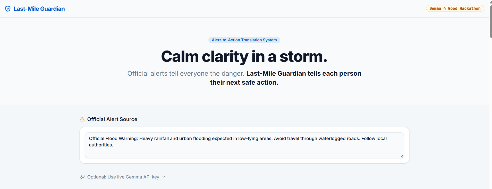
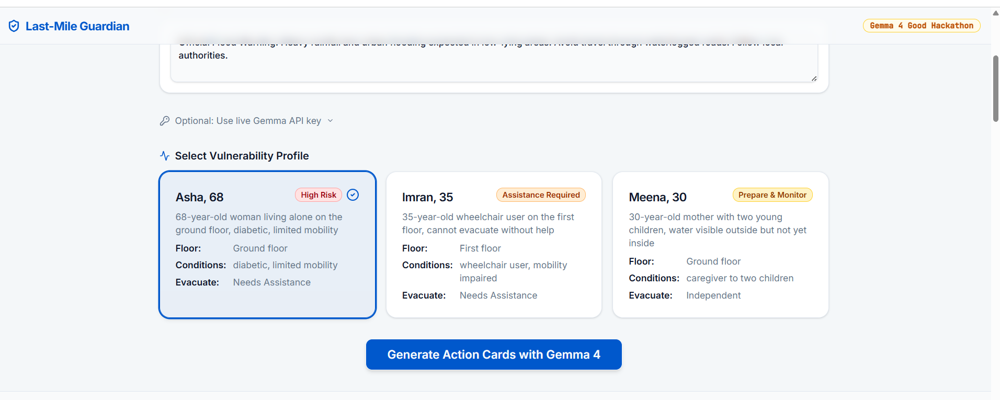
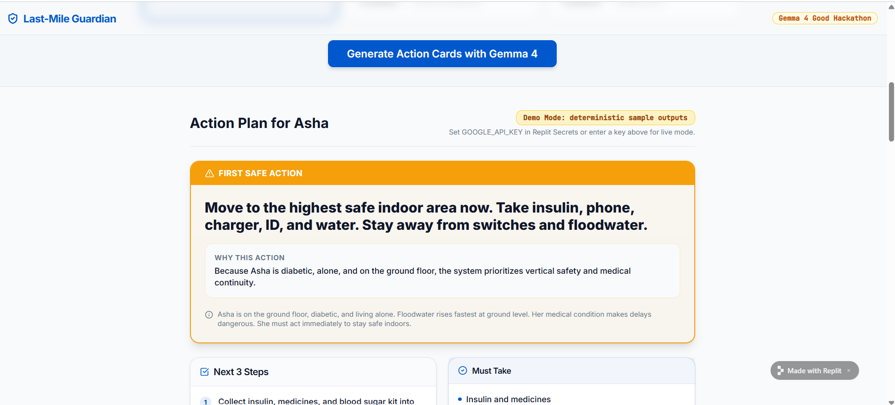
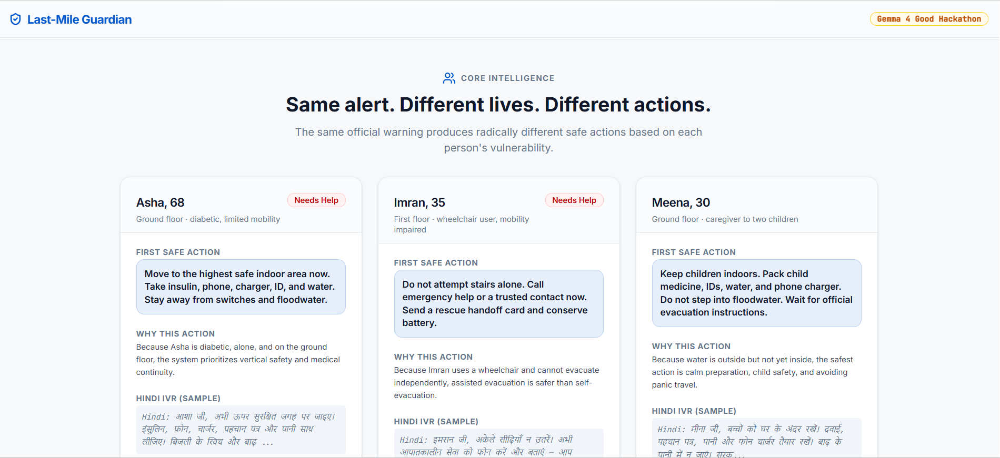
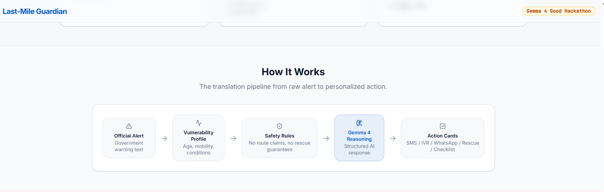
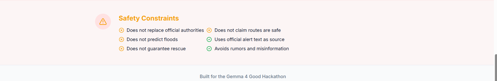

# Last-Mile Guardian

An alert-to-action translation layer for floods. Converts a single official government flood warning into personalized survival action cards for vulnerable people who may not know what to do next.

## Live Demo

Try the deployed MVP here:

https://simple-streamlit-app--sravaninomula55.replit.app/

## Screenshots

### Hero



### Vulnerability Profiles



### Personalized Action Plan



### Same Alert, Different Lives



### Architecture



### Safety Constraints




## The Problem

Official flood alerts are broadcast to everyone. But a 68-year-old diabetic woman living alone on the ground floor needs completely different actions than a wheelchair user on the first floor — and both need different guidance than a mother sheltering with two young children. The alert tells them the danger. It does not tell them their next safe action.

## Why Alerts Are Not Enough

- Generic language ("avoid waterlogged roads") is meaningless to someone who cannot move independently
- No channel adaptation — a WhatsApp message is useless without internet; a voice script is useless without literacy
- No medical consideration — skipping insulin during a flood is as dangerous as the flood itself
- No vulnerability-aware prioritization — the same "evacuate now" instruction is unsafe for a wheelchair user

## Why Gemma 4 Is Essential

Gemma 4 performs structured vulnerability-aware reasoning: given an official alert plus a person's profile (age, conditions, floor, mobility, language, connectivity), it generates:
- A personalized first safe action
- A step-by-step plan calibrated to their specific constraints
- SMS, IVR (Hindi), WhatsApp, and rescue handoff cards
- An offline checklist

This is not a chatbot. It is a single-purpose reasoning layer that translates a generic alert into a person-specific action plan.

## Modes

### Demo Mode (default)

Works immediately without any API key. Uses high-quality deterministic outputs for three vulnerability profiles:
- **Asha** — 68, diabetic, alone, ground floor, limited mobility → "High Risk"
- **Imran** — 35, wheelchair user, first floor, cannot evacuate alone → "Assistance Required"
- **Meena** — 30, mother with two children, water outside not inside → "Prepare & Monitor"

### Live Gemma Mode

Activates automatically when a valid API key is available. Priority order:
1. Key entered in the optional UI field (held in memory only for the session)
2. `GOOGLE_API_KEY` environment variable / Replit Secret
3. `GEMMA_API_KEY` environment variable / Replit Secret

To enable via Replit Secrets:
1. Open the Secrets panel in your Replit project
2. Add `GOOGLE_API_KEY` with your Google AI API key
3. Restart the API server — live mode activates automatically

If live mode fails for any reason, the app silently falls back to demo outputs and shows a warning banner.

## Safety Limitations

This tool does NOT:
- Replace official government authorities or NDMA guidance
- Predict flood severity beyond what the official alert states
- Guarantee rescue or claim rescue teams are on their way
- Claim any route is safe
- Tell users to walk through, enter, or cross floodwater
- Spread or repeat unverified forwarded information

This tool DOES:
- Use the official alert text as its only source
- Apply safety validation to all AI-generated outputs (rejects unsafe phrases)
- Fall back to verified safe demo outputs if live AI output fails validation

## Output Format

Each generated card contains:

| Field | Description |
|---|---|
| `first_action` | Single most important immediate action |
| `why_this_action` | Personalized reasoning |
| `next_3_steps` | Ordered follow-up steps |
| `must_take` | Essential items list |
| `do_not_do` | Safety warnings |
| `sms_card` | SMS-format message (<160 chars) |
| `ivr_script` | Hindi Devanagari + Romanized voice script |
| `whatsapp_family_card` | Family status message |
| `volunteer_rescue_card` | Rescue team handoff card |
| `offline_checklist` | Printable checklist |
| `gemma_reasoning_summary` | AI reasoning explanation |

## Code Map

The project is organized as a Replit-built TypeScript web app with a frontend, API layer, prompt logic, and deterministic demo outputs.

Key areas:

- `lib/` — core application and shared implementation files
- `scripts/` — project scripts and helper tooling
- `attached_assets/` — visual assets used by the app
- `README.md` — project documentation and judging guide
- `package.json` — project dependencies and run scripts
- `pnpm-workspace.yaml` — workspace configuration

Important implementation areas to inspect:

- Gemma/live mode integration
- demo-mode fallback outputs
- unsafe phrase validation
- persona-specific action-card generation
- structured JSON output generation
- UI for SMS, IVR, WhatsApp, rescue handoff, and offline checklist

## Setup

```bash
# Install dependencies
pnpm install

# Run API server (port 8080)
pnpm --filter @workspace/api-server run dev

# Run frontend (port 24730)
pnpm --filter @workspace/last-mile-guardian run dev

# Regenerate API types after spec changes
pnpm --filter @workspace/api-spec run codegen
```

## Demo Script (for judges)

1. Open the app — the "Same alert. Different lives." comparison loads automatically
2. See Asha, Imran, and Meena side by side with different First Safe Actions
3. Select a persona, click "Generate Action Cards with Gemma 4"
4. View the full card suite: SMS, Hindi IVR, WhatsApp, Rescue Handoff, Offline Checklist
5. Expand "Structured JSON Output" to see the machine-readable response
6. To test live Gemma mode: click "Optional: Use live Gemma API key" and paste a Google AI key

## Built For

Gemma 4 Good Hackathon
