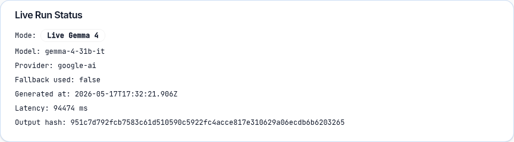
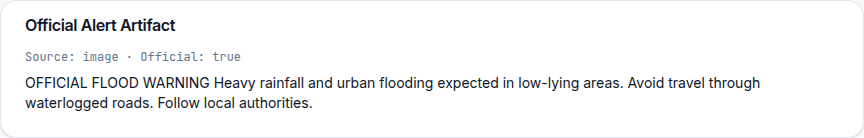
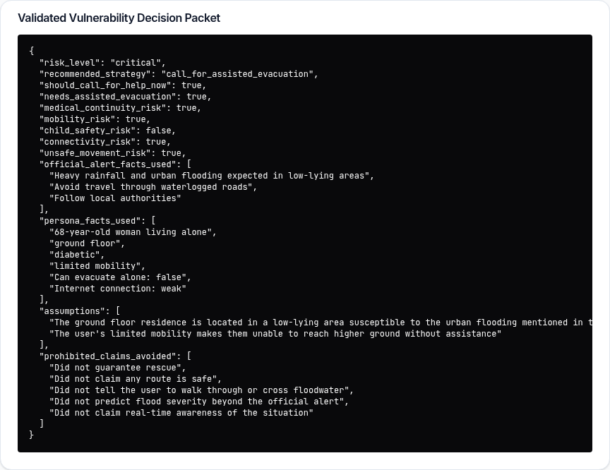
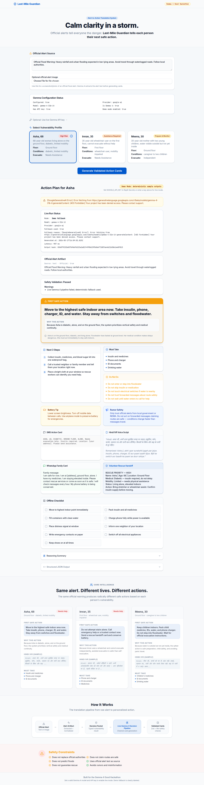
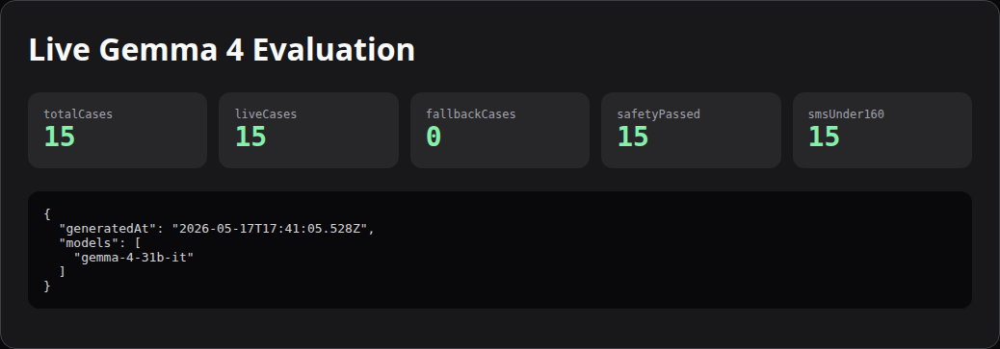

# Last-Mile Guardian

An alert-to-action translation layer for disasters, demonstrated first with urban flood alerts. Converts a single official government flood warning into personalized survival action cards for vulnerable people who may not know what to do next.

## Live Demo

Try the deployed MVP here:

https://simple-streamlit-app--sravaninomula55.replit.app/

## Screenshots

### Hero


### Vulnerability Profiles


### Personalized Action Plan


### Same Alert, Different Lives


### Architecture


### Safety Constraints


### Runtime Proof Screenshots

These judge-facing screens come from real app-rendered runtime artifacts:











These should be refreshed from a real app run whenever the configured live model changes.

## The Problem

Official flood alerts are broadcast to everyone. But a 68-year-old diabetic woman living alone on the ground floor needs completely different actions than a wheelchair user on the first floor — and both need different guidance than a mother sheltering with two young children. The alert tells them the danger. It does not tell them their next safe action.

## Why Alerts Are Not Enough

- Generic language ("avoid waterlogged roads") is meaningless to someone who cannot move independently
- No channel adaptation — a WhatsApp message is useless without internet; a voice script is useless without literacy
- No medical consideration — skipping insulin during a flood is as dangerous as the flood itself
- No vulnerability-aware prioritization — the same "evacuate now" instruction is unsafe for a wheelchair user

## Gemma 4 System

Last-Mile Guardian uses Gemma 4 as a staged alert-to-action pipeline:

1. Official alert extraction from text or image
2. Vulnerability decision packet generation
3. Channel-specific card generation
4. Schema validation
5. Life-safety validation
6. Visible deterministic fallback if live output fails

Live mode requires `GEMMA_MODEL_ID` to point to an actual Gemma 4 model. The backend refuses live mode if the model ID is not Gemma 4.

The UI displays model ID, provider, fallback status, latency, timestamp, and output hash for every generation.

## Modes

### Demo Mode

Demo mode uses deterministic safe cards. It is clearly labeled and never presented as live Gemma output.

- **Asha** — 68, diabetic, alone, ground floor, limited mobility → "High Risk"
- **Imran** — 35, wheelchair user, first floor, cannot evacuate alone → "Assistance Required"
- **Meena** — 30, mother with two children, water outside not inside → "Prepare & Monitor"

### Live Gemma 4 Mode

Live mode runs only when:

- `GEMMA_MODEL_ID` is set to a Gemma 4 model
- API key is available
- model output passes schema validation
- output passes life-safety validation

If any step fails, the API returns demo fallback cards with `fallbackUsed=true` and a visible fallback reason. For a strict judge run with fallback disabled, start the API with `ENABLE_DEMO_MODE=false`.

## Safety Limitations

This tool does NOT:
- Replace official government authorities or NDMA guidance
- Predict flood severity beyond what the official alert states
- Guarantee rescue or claim rescue teams are on their way
- Claim any route is safe
- Tell users to walk through, enter, or cross floodwater
- Spread or repeat unverified forwarded information

This tool DOES:
- Use official alert text as its source
- Validate typed intermediate model artifacts with Zod
- Apply deterministic life-safety validation before returning live cards
- Fall back visibly to deterministic safe cards if live AI output fails validation

## Output Format

Each generated result contains typed `alert`, optional `decisionPacket`, `cards`, `safety`, and `metadata` sections. The action cards include:

| Field | Description |
|---|---|
| `first_action` | Single most important immediate action |
| `why_this_action` | Personalized reasoning |
| `next_3_steps` | Ordered follow-up steps |
| `must_take` | Essential items list |
| `do_not_do` | Safety warnings |
| `sms_card` | SMS-format message (<160 chars) |
| `ivr_script` | Hindi Devanagari + Romanized voice script |
| `whatsapp_family_card` | Family status message |
| `volunteer_rescue_card` | Rescue team handoff card |
| `offline_checklist` | Printable checklist |
| `reasoning_summary` | Personalization explanation |

## Code Map

The project is organized as a TypeScript web app with a React frontend, Express API, OpenAPI contract, staged Gemma pipeline, and deterministic demo outputs.

Key areas:

- `artifacts/api-server/src/config/gemmaConfig.ts` — fail-closed live-model configuration
- `artifacts/api-server/src/lib/gemma/` — providers, prompts, typed pipeline, metadata, and safety validation
- `artifacts/api-server/src/lib/demoCards.ts` — deterministic fallback outputs
- `artifacts/last-mile-guardian/src/` — React frontend
- `lib/api-spec/openapi.yaml` — API contract and codegen source
- `eval/` — fixtures, live evaluation script, and generated result summaries
- `docs/` — implementation, safety case, and evaluation notes

## Setup

```bash
# Install dependencies
pnpm install

# Run API server (port 8080)
pnpm --filter @workspace/api-server run dev

# Run frontend (port 24730)
pnpm --filter @workspace/last-mile-guardian run dev

# Regenerate API types after spec changes
pnpm --filter @workspace/api-spec run codegen

# Verify code claims, types, tests, and build
pnpm verify
```

## Demo Script (for judges)

1. Open the app and click "Run Three-Person Comparison" when you want to spend three live pipeline runs
2. See Asha, Imran, and Meena side by side with different First Safe Actions
3. Select a persona, click "Generate Validated Action Cards"
4. Inspect Live Run Status, the validated decision packet, safety validation, and the full card suite
5. Upload an official alert screenshot to exercise image extraction
6. Expand "Structured JSON Output" to see the machine-readable card response
7. To test live mode, configure a valid Gemma 4 model ID plus API key and let the metadata prove whether the run was live

## Built For

Gemma 4 Good Hackathon
